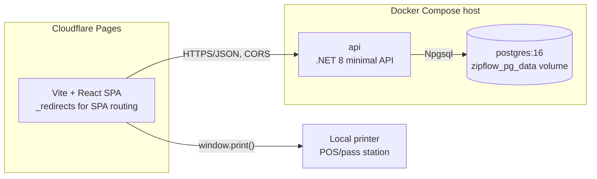

# ZIP Flow Architecture

This document is the source of truth for how ZIP Flow is built: deployment topology, layering,
what carries over unchanged from the existing foundation, the backend and frontend component
inventory, the API surface, and the idempotency approach. For the schema behind this, see
[DATA_MODEL.md](./DATA_MODEL.md); for the user-facing flow, see
[RESTAURANT_FLOW.md](./RESTAURANT_FLOW.md); for running it, see
[DEPLOYMENT.md](./DEPLOYMENT.md). It builds on the shape established in
[FOUNDATION_ARCHITECTURE.md](./FOUNDATION_ARCHITECTURE.md), adjusted below where this MVP
departs from it (Postgres instead of SQL Server, Cloudflare Pages instead of a bundled web
host).

## Deployment topology

The React SPA is a static build hosted on Cloudflare Pages. The API and its database run
together as two containers in one Docker Compose stack on a single host. The browser talks to
the API over HTTPS/JSON and prints directly to whatever printer is the local machine's
default — there is no server-side printing.

```
Cloudflare Pages                     Docker Compose (one host)
┌─────────────────────┐  HTTPS/JSON  ┌──────────────────────────┐
│ Vite + React SPA     │─────────────▶│ api (.NET 8 minimal API)│
│ public/_redirects    │◀──── CORS ───│  endpoints + services   │
│  (SPA routing)        │              │  EF Core                │
│ browser window.print()│              └───────────┬──────────────┘
└─────────────────────┘                            │ Npgsql
                                        ┌───────────▼──────────────┐
                                        │ postgres:16-alpine       │
                                        │ volume zipflow_pg_data   │
                                        └──────────────────────────┘
                                                    │
                                        (local printer, POS/pass station,
                                         driven by the browser's print dialog)
```



## Layering

The layering is deliberately flat and unchanged from the foundation: a minimal API endpoint
maps a route to a service method, the service method holds the business logic and calls EF
Core, EF Core talks to Postgres. There is no CQRS, no mediator, no event bus, and no repository
layer between the service and `AppDbContext`.

```
minimal API endpoint  →  service class  →  EF Core (AppDbContext)  →  Postgres
```

This keeps the request path for something like "send a round" traceable in one file each: the
endpoint validates and calls the service, the service computes totals and writes rows.

## Kept unchanged from the foundation

The following are untouched by this MVP and continue to work exactly as documented in
[FOUNDATION_ARCHITECTURE.md](./FOUNDATION_ARCHITECTURE.md):

- **JWT auth with refresh tokens** — access tokens carry identity and tenant context, not the
  full permission list; refresh tokens are stored hashed and rotated.
- **Permission-based authorization** — `PermissionPolicyProvider` and
  `PermissionAuthorizationHandler` evaluate policies such as `permission:pos.orders.create`
  dynamically against the database, so granting or revoking a permission takes effect without
  reissuing tokens.
- **The `ApiResponse<T>` envelope** — every endpoint response is wrapped consistently.
- **Tenant scoping via `ICurrentRequestContext`** — every query and write is scoped to the
  caller's tenant; no cross-tenant reads are possible through the API.
- **Audit logging** — the append-only `audit.AuditLog` table keeps recording tenant, location,
  user, entity, action, and summary for the actions this MVP performs.
- **The atomic per-tenant order-number counter** — `OrderService.NextOrderNumberAsync` draws
  the next `OrderNumber` from `pos.OrderNumberCounter` via a single atomic
  `UPDATE ... RETURNING`, so two terminals can never be handed the same number.

## Backend components after the change

| File | Change |
|---|---|
| `Domain/Entities.cs` | `Order` reshaped (payment/FX columns removed); `OrderRound` added; `StockItem`, `StockAdjustment`, `Recipe`, `RecipeIngredient`, `CurrencyRate` entities deleted; `Category.Station` removed |
| `Data/AppDbContext.cs` | `DbSet`s and model configuration for the deleted entities removed; `Order` configuration updated for the new column set and the partial unique index |
| `Services/OrderService.cs` | Rewritten around open / add-round / close / cancel. Payment, tender, FX conversion and stock consumption removed |
| `Services/TableService.cs` | `TableDto` gains the current open order's id and customer name, so the floor plan can jump straight into an occupied table's order |
| `Endpoints/OrderEndpoints.cs` | New verbs — see API surface below |
| `Services/MenuService.cs`, `Endpoints/MenuEndpoints.cs` | Category `Station` field dropped |
| `Services/SettingsService.cs`, `Endpoints/SettingsEndpoints.cs` | Currency-rate endpoints removed; receipt and tax settings kept |
| `Services/FoundationSeeder.cs` | Permission list trimmed to drop inventory/recipe/kitchen/currency permissions |
| `Program.cs` | Service registrations for the deleted services removed |
| Deleted | `Services/InventoryService.cs`, `Services/RecipeService.cs`, `Services/KitchenService.cs`, `Services/CurrencyService.cs`, `Endpoints/InventoryEndpoints.cs`, `Endpoints/RecipeEndpoints.cs`, `Endpoints/KitchenEndpoints.cs`, and any currency-rate endpoint file |

These files exist on `main` today at the paths above (verified against the current tree under
`backend/ZipFlow.Api/`); there is no kitchen-display endpoint file separate from
`KitchenEndpoints.cs`/`KitchenService.cs`, and no separate `CurrencyEndpoints.cs` — currency
rate endpoints live inside `SettingsEndpoints.cs`/`SettingsService.cs` and are trimmed there
rather than deleted as a whole file.

## API surface

| Method & path | Purpose | Body | Permission |
|---|---|---|---|
| `POST /api/orders` | Open a table | `{ tableId, customerName, customerPhone?, id? }` | `pos.orders.create` |
| `POST /api/orders/{id}/rounds` | Send a round | `{ id?, lines: [{ menuItemId, quantity, notes? }] }` | `pos.orders.create` |
| `POST /api/orders/{id}/close` | Close the order and produce the bill | — | `pos.orders.manage` |
| `POST /api/orders/{id}/cancel` | Void a mis-opened order and free the table | — | `pos.orders.manage` |
| `GET /api/orders/{id}` | One order with its rounds and lines | — | `pos.orders.view` |
| `GET /api/orders?status=&search=` | Order history | — | `pos.orders.view` |
| `GET /api/tables` | Floor plan; each table carries its open order, if any | — | `pos.tables.*` (unchanged) |

## Frontend routes and components

| Route | Component | Note |
|---|---|---|
| `/login` | `LoginPage` | Unchanged |
| `/` | `DashboardPage` | Tiles for removed modules (inventory, kitchen, currency) stripped |
| `/tables` | `TablesPage` | Becomes the floor plan and the service entry point; the open-table dialog captures the customer name and phone |
| `/pos/:orderId` | `PosPage` | Rewritten around one open order: menu grid, current round in progress, Send round, Close & print bill |
| `/orders` | `OrdersPage` | Payment columns removed; shows table, customer, and rounds; reprint bill |
| `/menu` | `MenuPage` | Recipe editor removed |
| `/settings` | `SettingsPage` | Currency-rate section removed; receipt and tax settings kept |
| `/print/orders/:orderId/round/:roundNumber` | `OrderPrintPage` | Round slip |
| `/print/orders/:orderId/bill` | `OrderPrintPage` | Full bill |

`OrderPrintPage` replaces the old `ReceiptPrintPage`; it takes its scope (one round, or the
whole order) from the route rather than being two separate components, matching the "one
layout, two scopes" idea in [RESTAURANT_FLOW.md](./RESTAURANT_FLOW.md#why-two-printing-moments).
`formatMoney` (`lib/currency.ts`) and the receipt-settings fetch are reused unchanged.

Deleted: `features/inventory/*`, `features/kitchen/*`, the `/reports` placeholder, the POS
payment sheet, the cash keypad, the currency switcher, the service-mode switcher, and the
takeaway marker field. The nav rail becomes Overview · Tables · POS · Orders · Menu, with
Settings at the bottom.

## Idempotency

`POST /api/orders` and `POST /api/orders/{id}/rounds` both accept a client-generated `id`. This
reuses the idempotency approach already present for creating orders: if a network drop causes
the frontend to retry a call it already sent, the server recognizes the same client-supplied id
and treats it as the same write rather than creating a duplicate order or double-sending a
round of food to the kitchen. For `OrderRound` specifically, the client-supplied id is also the
table's primary key, so a duplicate send is rejected by the primary-key constraint itself — see
[DATA_MODEL.md](./DATA_MODEL.md#new--posorderround) for the schema detail.

## Out of scope

Payment of any kind, a kitchen display, inventory/recipe stock consumption, multi-currency
exchange rates, and a second printer with client-side or agent-based routing are all explicitly
out of scope for this architecture. Each is a plausible next module on top of the flat layering
described here.
